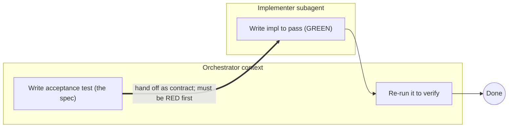

# spec-tdd — test-first development skills for Claude Code

**Version 1.12.0** · [Protocol](PROTOCOL.md) · [Changelog](CHANGELOG.md) · [License](LICENSE)

A family of [Claude Code](https://claude.com/claude-code) skills enforcing **a protocol for preventing correlated test/implementation failure in AI-generated software** (the technical name for the *green lie*). Executable specifications, agent-boundary isolation, and independent verification for agentic TDD.

> **New here?** Skip the map: `/spec-tdd-escalate <feature>` reads your spec, checks it's actually settled, and routes to the right tier for you. Come back for the chart when you want manual control.

## The problem: the green lie

Let one agent write both the tests and the code and you get the **green lie** — tests that pass only because the same mind wrote both, so they mirror the implementation's assumptions, skip the edges it forgot, and assert tautologies. The suite goes green; the code is still wrong. **You let the same brain be both referee and player.**

Most TDD guidance fights this with *prompting* — exhorting the agent to stay objective. Same agent, same context, trying not to fool itself. Under pressure, it loses.

## The fix: an agent boundary

`spec-tdd` doesn't persuade; it changes the **structure**. One agent (the orchestrator) writes the acceptance test — the spec — *before any implementation exists*, then hands it to a *different* agent (the implementer) as the contract. Written before the impl, by a different context, the test cannot have been reverse-engineered to mirror it (it can still be *wrong* — see below):

> **"Must be RED first" is the built-in green-lie detector.**

This isn't a new religion — it's established software engineering (black-box testing, contract / seam-driven design, independent verification) ported to agent orchestration. The agent boundary turns "don't fool yourself" from a discipline into a structural guarantee **against the green lie** — the test cannot have been reverse-engineered to mirror the impl. It does not guarantee the spec is *right* (a misread requirement still makes a bad test); that failure mode is handled by other mechanisms — RED-first, the Phase-3 adversarial read, the grill, and the independent attacker.

Each skill was authored and pressure-tested with the TDD-for-docs process (baseline a failure mode without the skill, then write the skill to counter it) — the baseline & pressure-test records are public in [`docs/specs/`](docs/specs/) (small-N, single-maintainer experiments; honest about what they are).

## Architecture & Agent Boundaries

The anti-green-lie guarantee comes from **separating spec-authoring and implementation into different agent contexts**; `spec-tdd-adversarial` adds a third, independent context (an attacker) for critical paths; `spec-tdd-lite` crosses the boundary exactly once — for the review — and implements in-session. Two views — the core principle, then the complete flow.

### Core — why the agent boundary matters



The acceptance test is written in the orchestrator's context *before* the impl exists, then handed to a different context (the implementer) as the contract. Crossing that boundary is what stops the test from mirroring the impl — the whole point.

### Complete flow


- **Orchestrator → Implementer** is the delegation handoff (acceptance test = contract); the **circuit breaker** caps the implementer's repair loop — STOP after 3 attempts OR the same root cause on any two attempts — and tags `ERR-01 env · ERR-02 logic · ERR-03 syntax`.
- **Verification is orchestrator-run** ("don't trust the subagent's self-report"): it re-hashes the acceptance test to prove the implementer didn't edit it (**SPEC-INTEGRITY**), then **routes by root cause** — three buckets: SPEC (re-open the requirement) → rewrite the test; TEST (requirement right, test weak/incomplete) → strengthen the test; IMPL (code wrong) → re-delegate.
- **No unaudited test crosses the boundary.** Before any implementer dispatch, a fresh-context reviewer checks the acceptance test encodes its spec — every line asserted with discriminating power, wrong-but-plausible readings named, over-assertion and silent interpretations surfaced (**I13**, family-wide; lite reviews post-GREEN; adversarial-grill's Part B is this audit at adversarial grade).
- **Context3 (attacker)** is `spec-tdd-adversarial` only. `grill-spec-tdd` gates the **spec** (the grilled decisions) *before* the acceptance test is written — the test is derived from the **final**, gate-approved spec — then routes to the matching tier; `spec-tdd-escalate` is the no-grill sibling — it routes a settled requirement straight to the matching tier, and that tier writes the test in its own Phase 1.
- **`spec-tdd-lite`** stays in the orchestrator's context: acceptance test (RED) → in-session inner loop → ONE fresh-context review dispatch → done (stall → promote to `spec-tdd`).

## The family

Seven skills, organized as **a verification ladder + three front-ends** — `grill-spec-tdd` (grill a fuzzy requirement, gate the spec, then route), `adversarial-grill-spec-tdd` (fuzzy **+ critical**: grill, independent auditor attacks the decisions before the gate and the final-spec test before dispatch), and `spec-tdd-escalate` (route a settled requirement, no grilling):

| Skill | Role |
|---|---|
| [`spec-tdd-lite`](skills/spec-tdd-lite/SKILL.md) | The in-session entry tier. Acceptance test (RED) → implement it yourself → **one fresh-context review dispatch**. For ONE small/non-critical unit in a session you'll clear after. |
| [`spec-tdd`](skills/spec-tdd/SKILL.md) | The base. Orchestrator writes the acceptance test (RED), gets a fresh-context **encoding audit**, delegates to one subagent, verifies by running it. **Multi-unit runs**: a bug list or task-split feature loops the phases per unit — the agent boundary is per unit. |
| [`spec-tdd-coverage`](skills/spec-tdd-coverage/SKILL.md) | `spec-tdd` + **coverage evidence**: the subagent declares a case-list *before* impl (each case mapped to its branch) and reports per-class branch %; the orchestrator cross-checks the mapping both ways against the coverage report (or the impl's branch statements where the tool reports no branch detail). |
| [`spec-tdd-adversarial`](skills/spec-tdd-adversarial/SKILL.md) | `spec-tdd-coverage` + an **independent attacker** (a third agent context) that tries to write a wrong-but-green impl and hunts uncovered branches, then a **terminal dry-loop audit** — fresh subagents rotating lenses (test-strength / plan fidelity / deployment-ops / production quality); stops on the first clean round, capped at 2 (5 with the `dryout` flag — the only difference); a cap hit while not yet clean asks the human whether to continue (one round per yes). Top tier — blast-radius-critical units only (a silent bug moves money / changes auth / irreversibly corrupts data; money-adjacent display/reporting doesn't qualify). |
| [`grill-spec-tdd`](skills/grill-spec-tdd/SKILL.md) | A **front-end**: interrogate a fuzzy/high-stakes requirement ("grill"), gate the SPEC (the grilled decisions — irreversible ones demand named confirmation, never a bulk default) with a human **before any test is written**, derive the acceptance test from the **final** spec, *then route* to whichever verification tier fits. |
| [`adversarial-grill-spec-tdd`](skills/adversarial-grill-spec-tdd/SKILL.md) | The **critical-grade front-end**: grill-spec-tdd plus an **independent grill-auditor** dispatched twice — the decisions (incl. materiality stops) attacked BEFORE the gate, the final-spec acceptance test attacked after it (pre-dispatch) — independence at the cheapest moments (no impl tokens spent). Fuzzy + critical (money/auth/data-loss) only. |
| [`spec-tdd-escalate`](skills/spec-tdd-escalate/SKILL.md) | A **front-end** for SETTLED requirements: skips grilling and auto-routes to whichever verification tier fits the stakes — full-auto, no gate (a one-pass **fuzziness sniff** first checks the doc is actually decided; a clean doc never triggers a question). |

`spec-tdd-lite` is the entry rung — in-session (no implementer dispatch, one review dispatch). Above it the ladder inherits upward: `spec-tdd` → `spec-tdd-coverage` → `spec-tdd-adversarial`. `grill-spec-tdd` and `spec-tdd-escalate` are orthogonal front-ends: `grill-spec-tdd` grills a fuzzy requirement then routes; `spec-tdd-escalate` routes a settled one with no grilling. `adversarial-grill-spec-tdd` is grill's critical-grade upgrade (fuzzy + critical only; typically routes onward to `spec-tdd-adversarial`). Front-ends compose with the tiers — `{grill, escalate} × {lite, spec-tdd, coverage, adversarial}` plus `adversarial-grill × {spec-tdd, coverage, adversarial}` (never lite: a critical surface doesn't go in-session) — all reachable **without** duplicating skills into monolithic combos.

Every **delegated** tier's handoff carries a **circuit breaker** (STOP after 3 repair attempts OR the same root cause on any two attempts; tag the failure `ERR-01` env/dep · `ERR-02` logic · `ERR-03` syntax, with a truncated trace) and **three-bucket failure routing** — SPEC (re-open the requirement) → rewrite the test; TEST (requirement right, test incomplete) → strengthen the test; IMPL (code wrong) → re-delegate with the error tag. `spec-tdd-lite` has no handoff: its in-session stall breaker (same trip rules) promotes to `spec-tdd` instead.

### What a run costs

Typical single-unit dispatch counts (the protocol's main token cost — I19 keeps them lean; planning is never dispatched):

| Skill | Dispatches beyond your session | What they are |
|---|---|---|
| `spec-tdd-lite` | 1 | fresh test review (**TOP**) — impl stays in-session |
| `spec-tdd` | 2 | encoding audit (**TOP**) + implementer (**MID**) — verification is your own re-run, no dispatch |
| `spec-tdd-coverage` | 2 | same as `spec-tdd` — case-list + coverage numbers ride the implementer dispatch; the bidirectional gap-check is orchestrator-side |
| `spec-tdd-adversarial` | 4–6 | audit (**TOP**) + implementer (**MID**) + attacker rounds (**TOP**, ×1–3, breaker-capped) + dry-loop audit (**TOP**, ×1–2; cap 2, or 5 with `dryout`) |
| `grill-spec-tdd` | same as the tier, or +1 on lite | the front-end's encoding audit (**TOP**) **replaces** the tier's own — grill→`spec-tdd` still totals 2; only the `spec-tdd-lite` route adds one (audit + lite's post-GREEN review); the grilling itself is in-session |
| `adversarial-grill-spec-tdd` | +1 net on the routed tier | grill-auditor Parts A & B (**TOP**) — Part B is the tier's encoding audit at adversarial grade, so it replaces rather than adds; → `spec-tdd-adversarial` totals 5–6 typical (Part A is the only net addition) |
| `spec-tdd-escalate` | 0 of its own | the fuzziness sniff is a doc read; it routes to one of the above |

Every dispatch names its model (reviews/attacks TOP, implementers MID — an unstated model silently inherits the session's most expensive). A multi-unit run multiplies the per-unit dispatch pair — encoding audit + implementer — per unit, grouped where modules overlap.

## When to use which

```
Requirement SETTLED and you want the tier picked for you?
  yes → spec-tdd-escalate   (auto-routes by stakes; fuzziness sniff; no grilling, no gate)

Otherwise pick the tier yourself:
Requirement FUZZY or high-stakes?
  yes → Blast-radius-critical? (a silent bug MOVES money / CHANGES auth /
        IRREVERSIBLY corrupts data — money-adjacent is not money-movement)
          yes → adversarial-grill-spec-tdd   (grill + independent audits: decisions pre-gate, test pre-dispatch — then it routes to the tier)
          no  → grill-spec-tdd   (grill + gate the spec, then routes to the right tier)
  no  → Blast-radius-critical? (same litmus)
          yes → spec-tdd-adversarial
          no  → Need branch-coverage EVIDENCE? (large/subtle branch surface, weak tests, compliance)
                  yes → spec-tdd-coverage
                  no  → How many units?
                          ONE small unit (bugfix-scale, non-critical,
                          session cleared after)
                            → spec-tdd-lite   (in-session: test → implement → one review)
                          MULTIPLE units (bug list / feature split)
                            → spec-tdd       (multi-unit run: boundary per unit)
                          otherwise → spec-tdd      (the cheap default)
```

Rule of thumb: requirement already settled and you just want it routed? Use `spec-tdd-escalate`. Fuzzy, or you want to interrogate it first? Start with `grill-spec-tdd` — it grills and routes to the matching tier for you. Fuzzy AND blast-radius-critical — a silent bug would move money, change auth, or irreversibly corrupt data (money-adjacent display/reporting doesn't count)? `adversarial-grill-spec-tdd` — an independent auditor attacks the grill itself before anything is built. One small unit and a session you'll clear after? `spec-tdd-lite`. Several units — a bug list, a split feature? `spec-tdd` as a multi-unit run.

## How it relates to the `superpowers` plugin

Complementary, not redundant:

- `superpowers:test-driven-development` is single-agent atomic TDD (RED→GREEN→REFACTOR). `spec-tdd` *uses* that discipline but splits it across the agent boundary — adding the structural green-lie defense that single-agent TDD cannot provide.
- `superpowers:subagent-driven-development` verifies via a reviewer reading a *prose spec*; `spec-tdd` verifies by *running an executable spec* (the acceptance test). Different bets, and `spec-tdd` is far lighter (1 subagent vs implementer + 2 reviewers per task). `spec-tdd`'s multi-unit runs close the cadence gap — per-unit dispatch with between-unit verification — without giving up the executable oracle.
- `spec-tdd-lite` is the self-contained in-session option: a distilled red-green-refactor loop inline, plus the one fresh-context test review that single-agent TDD cannot give itself.

You do **not** need `superpowers` installed — `spec-tdd` is self-contained.

## Installation

Copy the skills into your personal skills directory:

```bash
# from this repo's root
cp -r skills/* ~/.claude/skills/
```

Then invoke in Claude Code with `/<skill-name> <feature>`, e.g.:

```
/grill-spec-tdd add coupon discounts to checkout (Java/Spring, Order at src/main/.../Order.java)
```

## A quick walkthrough

1. **Grill** — `grill-spec-tdd` grounds in the codebase first, then interrogates every dimension in rounds (business logic, boundaries, state transitions, NFRs, security/fraud). It asks **decisions, not facts** — whatever the code/docs already answer is investigated, never asked of you — and every question carries a recommended answer, so your reply is a veto ("all defaults except 3"), not an essay.
2. **Gate the SPEC** — the grilled decisions (plain language, amendments welcome) + the tier choice surface for ONE human OK **before any test is written**; the approved + amended decisions are the **final spec**, persisted as a doc by default (`docs/specs/…` — say the word to skip).
3. **Write the acceptance test** — derived from the final spec; behavioral, black-box; run it to confirm RED; an independent **encoding audit** (fresh context) checks it before routing.
4. **Route** — `grill-spec-tdd` picks the tier by blast radius (e.g. money movement → `spec-tdd-adversarial`; a statement-display unit → `spec-tdd-coverage`).
5. **Delegate** — a subagent (mid-tier model, stated on the dispatch) implements to green; the circuit breaker guards against runaway loops, and evidence comes back as status lines + a log file, not a pasted log.
6. **Verify** — the orchestrator runs the acceptance test itself, reads it adversarially, reports.

For plain `spec-tdd`, skip the grill batch and route — tiers run **after** the spec is final, so they add no human gate of their own; if the spec isn't a doc (settled only in the conversation) it asks once whether to persist one (default yes); the test surfaces to the human at verification time. For fuzzy **+ critical** requirements, `adversarial-grill-spec-tdd` dispatches an independent auditor twice: after the grill (attacking the decisions and materiality stops, pre-gate) and after the test is written from the final spec (pre-dispatch) — the family's independence principle moved to the cheapest moments. For `spec-tdd-escalate`, skip the grill entirely — give it a settled requirement and it auto-routes to the right tier (no gate; the tier writes the test in its own Phase 1) — after a one-read **fuzziness sniff** checks the doc is actually decided (gaps surface as one grill-or-route ask; the user's call wins). For `spec-tdd-lite`, there is no delegation: acceptance test RED → implement in-session → one review dispatch → surface the test + findings. For a batch — a bug list or a split feature — `spec-tdd` runs multi-unit: unit plan (surfaced, not gated — the spec is already final) → the phases per unit (grouped dispatches where modules overlap) → batch summary.

## Why it works

- **Agent-boundary = anti-green-lie.** A test written before the impl exists, by a different context, can't have been reverse-engineered to mirror it (it can still be *wrong* — handled by the mechanisms below).
- **In-session without going bare.** `spec-tdd-lite` keeps acceptance-test-first and adds a fresh-context review — the two cheap structural defenses — for ONE small unit in a session you'll clear after.
- **Human validates WHAT, agent validates HOW.** The pipeline separates the two failure modes a same-agent flow conflates: a *wrong spec* is the human's call — in the grill front-ends, a gate on the **decision spec before any test is written** (amendments fold into the final spec the test then encodes); in the tiers, reviewing the surfaced **test** — and a *wrong implementation* is the agent's call — caught by **running** the test. Review WHAT, not HOW.
- **Coverage as evidence, not luck.** `spec-tdd-coverage` makes branch coverage a measured, reported artifact with a case-list to audit — every case mapped to its branch and cross-checked both ways against the coverage report, countable rather than vibes.
- **Independence for critical paths.** `spec-tdd-adversarial` adds a third context (an attacker) that a diligent same-context agent cannot give itself.
- **Grill before you build.** `grill-spec-tdd` forces every requirement dimension explicit (incl. NFR + security) instead of collapsing to "sensible defaults" under pressure — asking decisions, not facts (the code answers facts; the human answers choices, each with a recommended default to veto).
- **Independence at the cheapest moments, for fuzzy-critical work.** `adversarial-grill-spec-tdd` moves the family's independence principle as far forward as it can go: an independent auditor attacks the grill's decisions (incl. materiality stops) **before the gate**, and the final-spec acceptance test **before dispatch** — zero implementation tokens spent either way. Re-reading is not the fix — only independence is.
- **Spec docs persist by default.** When no spec/plan/blueprint doc exists, the run persists one (`docs/specs/YYYY-MM-DD-<feature>.md`) — the final decision spec at the grill gate, or the requirement + interpretation decisions + test path at tier Phase 1 — so later recall (requirement re-opens, PR review, audits) never depends on session memory. Only an explicit decline skips it.
- **Auto-route when decided.** `spec-tdd-escalate` picks the tier for you when the requirement is already settled — no grilling, no gate, route-only; its fuzziness sniff refuses to silently route a doc that only looks settled (settled must mean decided, I20).
- **Dispatch economy, none of it weaker.** Every dispatch names its model — planning is never dispatched (it stays in your session), every review/attack dispatch runs top-tier, implementers run mid-tier (an unstated model silently inherits the session's most expensive); evidence and settled specs move as files (log paths, the persisted spec doc), and verification is always the orchestrator's own re-run — cheaper transport, same guarantees (I19).

## License

MIT — see [LICENSE](LICENSE).
