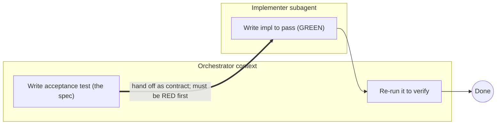
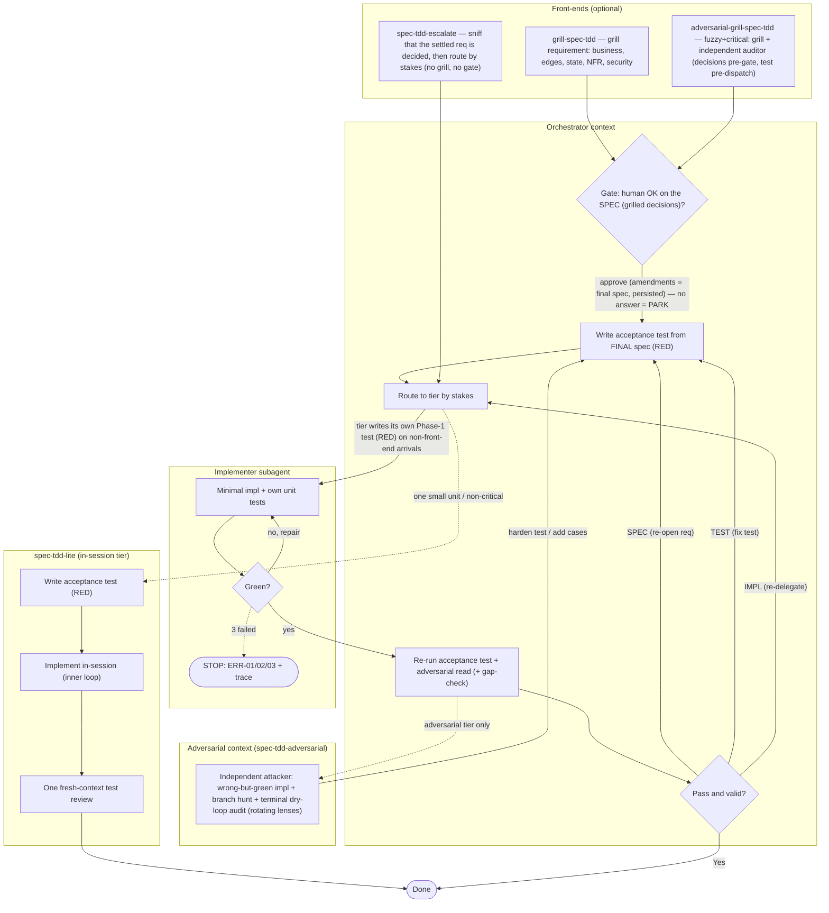

# spec-tdd — test-first development skills for Claude Code

**Version 1.27.1** · [Protocol](skills/PROTOCOL.md) · [Changelog](CHANGELOG.md) · [License](LICENSE)

A family of [Claude Code](https://claude.com/claude-code) skills enforcing **a protocol for preventing correlated test/implementation failure in AI-generated software** (the technical name for the *green lie*). Executable specifications, agent-boundary isolation, and independent verification for agentic TDD.

> **New here?** One command, the whole pipeline: `/spec-tdd-manager <your feature>` walks it end to end — grills what's fuzzy, breaks it into tasks, audits the plan with an independent read-only auditor, then delegates the implementation (mid-tier machinery, top-tier reviews). **You show up exactly twice**: approve the decisions, approve the plan + route + go. Come back for the chart when you want manual control.

## One command, the whole pipeline

```text
/spec-tdd-manager add coupon discounts to checkout

  S0  resume check   — left artifacts on disk? it picks up there
  S1  grill       →  Gate 1 · you approve the decisions
  S2+3 size & split — one unit, or a task plan authored for you
  S4  audit         — an independent TOP-tier auditor attacks the plan
  Gate 2          →  you approve plan + route + go
  S5  implement     — supervisor / task-loop eco / task-dag eco
```

That is the daily surface. The thirteen skills under the hood — a verification ladder, front-ends, three delegation drivers — are machinery the manager invokes by name; you'll rarely type them yourself. Special shapes route themselves too (a plain bug batch goes to the lightweight multi-unit run; a money/auth/data-loss path escalates to the independent-attacker tier; an interrupted run resumes from disk). The rest of this README is what's underneath, and why each piece exists.

## The problem: the green lie

Let one agent write both the tests and the code and you get the **green lie** — tests that pass only because the same mind wrote both, so they mirror the implementation's assumptions, skip the edges it forgot, and assert tautologies. The suite goes green; the code is still wrong. **You let the same brain be both referee and player.**

Most TDD guidance fights this with *prompting* — exhorting the agent to stay objective. Same agent, same context, trying not to fool itself. Under pressure, it loses.

One recorded instance, from the family's own lab ([2026-09-05 lean-lab run](docs/specs/2026-09-05-v116-lean-lab.md)): a fee-rounding spec said "nearest 10, halfway up". The test author and the implementer were **two fresh, independent contexts** — and both independently read the clause as toward +∞ for negatives: **−145 → −140**. GREEN delivered; the hidden oracle said the seeded caller's real shape is mirror-about-zero: **−145 → −150**. Two independent minds, one shared misread — the green lie survives even an agent boundary, which is why the family layers more than the boundary (the rest of this README).

## The fix: an agent boundary

`spec-tdd` doesn't persuade; it changes the **structure**. One agent (the orchestrator) writes the acceptance test — the spec — *before any implementation exists*, then hands it to a *different* agent (the implementer) as the contract. Written before the impl, by a different context, the test cannot have been reverse-engineered to mirror it (it can still be *wrong* — see below):

> **"Must be RED first" is the built-in green-lie detector.**

This isn't a new religion — it's established software engineering (black-box testing, contract / seam-driven design, independent verification) ported to agent orchestration. The agent boundary turns "don't fool yourself" from a discipline into a structural guarantee **against the green lie** — the test cannot have been reverse-engineered to mirror the impl. It does not guarantee the spec is *right* (a misread requirement still makes a bad test); that failure mode is handled by other mechanisms — RED-first, the Phase-3 adversarial read, the grill, and the independent attacker. The boundary also has a floor: the handoff itself (`INTENT`, `READ FIRST`) necessarily carries the orchestrator's interpretations into the implementer's — and, on the adversarial tier, the attacker's — context, so correlation is reduced, not eliminated; the adversarial tier's independent third context is the priced answer to that residual.

Each skill was authored and pressure-tested with the TDD-for-docs process (baseline a failure mode without the skill, then write the skill to counter it) — the baseline & pressure-test records are public in [`docs/specs/`](docs/specs/) (small-N, single-maintainer experiments; honest about what they are).

## Architecture & Agent Boundaries

The anti-green-lie guarantee comes from **separating spec-authoring and implementation into different agent contexts**; `spec-tdd-adversarial` adds a third, independent context (an attacker) for critical paths; `spec-tdd-lite` crosses the boundary exactly once — for the review — and implements in-session. Two views — the core principle, then the complete flow.

### Core — why the agent boundary matters



The acceptance test is written in the orchestrator's context *before* the impl exists, then handed to a different context (the implementer) as the contract. Crossing that boundary is what stops the test from mirroring the impl — the whole point.

### Complete flow



- **Orchestrator → Implementer** is the delegation handoff (acceptance test = contract); the **circuit breaker** caps the implementer's repair loop — STOP after 3 attempts OR the same root cause on any two attempts — and tags `ERR-01 env · ERR-02 logic · ERR-03 syntax`.
- **Verification is orchestrator-run** ("don't trust the subagent's self-report"): it re-hashes the acceptance test to prove the implementer didn't edit it (**SPEC-INTEGRITY**), then **routes by root cause** — three buckets: SPEC (re-open the requirement) → rewrite the test; TEST (requirement right, test weak/incomplete) → strengthen the test; IMPL (code wrong) → re-delegate.
- **No unaudited test crosses the boundary.** Before any implementer dispatch, a fresh-context reviewer checks the acceptance test encodes its spec — every line asserted with discriminating power, wrong-but-plausible readings named, over-assertion and silent interpretations surfaced (**I13**, family-wide; lite reviews post-GREEN; adversarial-grill's Part B is this audit at adversarial grade).
- **Context3 (attacker)** is `spec-tdd-adversarial` only. `grill-spec-tdd` gates the **spec** (the grilled decisions) *before* the acceptance test is written — the test is derived from the **final**, gate-approved spec — then routes to the matching tier; `spec-tdd-escalate` is the no-grill sibling — it routes a settled requirement straight to the matching tier, and that tier writes the test in its own Phase 1.
- **`spec-tdd-lite`** stays in the orchestrator's context: acceptance test (RED) → in-session inner loop → ONE fresh-context review dispatch → done (stall → promote to `spec-tdd`).

## The family

Thirteen skills — you'll type one of them. The full map, for when you want manual control: **a verification ladder + six front-ends + three parallel outer drivers — multi-task serial ([`spec-tdd-task-loop`](skills/spec-tdd-task-loop/SKILL.md)), multi-task parallel-DAG ([`spec-tdd-task-dag`](skills/spec-tdd-task-dag/SKILL.md)), and single-unit full delegation ([`spec-tdd-supervisor`](skills/spec-tdd-supervisor/SKILL.md))** — `grill-spec-tdd` (grill a fuzzy requirement, gate the spec, then route), `adversarial-grill-spec-tdd` (fuzzy **+ critical**: grill, independent auditor attacks the decisions before the gate and the final-spec test before dispatch), `spec-tdd-escalate` (route a settled requirement, no grilling), the two **plan-audit front-ends** `spec-2nd-opinion` / `spec-3rd-opinion` (independent read-only auditors verify a settled plan's facts/drift/interactions/ordering/grill coverage **before implementation**; gate on agreement — two or three opinions), and the **full-pipeline front door** `spec-tdd-manager` (the whole running order in one invocation — grill → breakdown → audit → routed implementation):

| Skill | Role |
|---|---|
| [`spec-tdd-lite`](skills/spec-tdd-lite/SKILL.md) | The in-session entry tier. Acceptance test (RED) → implement it yourself → **one fresh-context review dispatch**. For ONE small/non-critical unit in a session you'll clear after. |
| [`spec-tdd`](skills/spec-tdd/SKILL.md) | The base. Orchestrator writes the acceptance test (RED), gets a fresh-context **encoding audit**, delegates to one subagent, verifies by running it. **Multi-unit runs**: a bug list or task-split feature loops the phases per unit — the agent boundary is per unit; disjoint units run as **parallel waves** (scratch-copy isolated, allowlist merge-back), shared-file units as serial chains. |
| [`spec-tdd-coverage`](skills/spec-tdd-coverage/SKILL.md) | `spec-tdd` + **coverage evidence**: the subagent declares a case-list *before* impl (each case mapped to its branch) and reports per-class branch %; the orchestrator cross-checks the mapping both ways against the coverage report (or the impl's branch statements where the tool reports no branch detail). |
| [`spec-tdd-adversarial`](skills/spec-tdd-adversarial/SKILL.md) | `spec-tdd-coverage` + an **independent attacker** (a third agent context) that tries to write a wrong-but-green impl and hunts uncovered branches, then a **terminal dry-loop audit** — fresh subagents rotating lenses (test-strength / plan fidelity / deployment-ops / production quality); stops on the first clean round, capped at 2 (5 with the `dryout` flag — the only difference); a cap hit while not yet clean asks the human whether to continue (one round per yes). Top tier — blast-radius-critical units only (a silent bug moves money / changes auth / irreversibly corrupts data; money-adjacent display/reporting doesn't qualify). The loop's verification runs are **batched** (cross-file mutants, one-shot strengthen verification — I19(f)), only critical/moderate holes buy a round, and a `timebox` flag trades disclosed degradations for wall-clock (concurrent attack parts, merged dry-loop, diff-scoped attack). On multi-unit batches the attacker + dry-loop **consolidate over the whole batch** (dispatched as the final wave dispatches; breaker judged per hole) instead of multiplying per unit. |
| [`grill-spec-tdd`](skills/grill-spec-tdd/SKILL.md) | A **front-end**: interrogate a fuzzy/high-stakes requirement ("grill"), gate the SPEC (the grilled decisions — irreversible ones demand named confirmation, never a bulk default) with a human **before any test is written**, derive the acceptance test from the **final** spec, *then route* to whichever verification tier fits. |
| [`adversarial-grill-spec-tdd`](skills/adversarial-grill-spec-tdd/SKILL.md) | The **critical-grade front-end**: grill-spec-tdd plus an **independent grill-auditor** dispatched twice — the decisions (incl. materiality stops) attacked BEFORE the gate, the final-spec acceptance test attacked after it (pre-dispatch) — independence at the cheapest moments (no impl tokens spent). Fuzzy + critical (money/auth/data-loss) only. |
| [`spec-tdd-escalate`](skills/spec-tdd-escalate/SKILL.md) | A **front-end** for SETTLED requirements: skips grilling and auto-routes to whichever verification tier fits the stakes — full-auto below the top tier (bounded asks only: the **fuzziness sniff** on a doc that only looks settled, I21's tier check on a non-top session), plus ONE confirmation when the machine computes the top-tier adversarial route — the family's most expensive run never launches on a machine's say-so alone. |
| [`spec-tdd-task-loop`](skills/spec-tdd-task-loop/SKILL.md) | The **outer driver** for a whole multi-TASK feature phase — a task plan split into self-contained task docs, one task per commit, a plan-doc status board + numbered decisions section. Entering with only a settled requirement or blueprint (not yet split) bootstraps the breakdown first (**Phase 0**: the top session drafts the board + task docs — planning is never dispatched — then a fresh-context reviewer attacks coverage / order / self-containment / granularity; reviewer-converged + orchestrator sign-off opens the loop). The main session stays a **lightweight gate** (compile, `git diff --stat`, JUnit-XML number recheck — never deep review, never running the tests itself); each task dispatches a **level-1 sub-agent** that runs the escalate/tier machinery and itself dispatches the nested implementer (no self-testing; needs `CLAUDE_CODE_MAX_SUBAGENT_SPAWN_DEPTH=3`). Adds mock-first contract phases (tier may drop against the mock until a real-API alignment task — the time dimension of tier choice), mid-run tier downgrades delivered by message and disclosed, half-finished-task resume (audit the diff vs the task doc; keep, don't rewrite), the number-recheck discipline (XML, invocation counts, one final all-classes run), and a **closing batch review** — one fresh-context TOP pass over the whole phase's accumulated diffs, docs, and disclosures, attacking what only a cross-task view can see (inconsistent shapes of one concept, un-extracted duplication across task boundaries, accumulated regression-wall drift, merged disclosure patterns); its findings auto-open as new board rows that run through the same loop. Adds an **anti-idle in-flight watchdog** (zero-output duration is the first-class metric): every background dispatch is armed at dispatch time with its delivery class registered — real-output age (tree diff / test-results / deliberate task-scratch for output-type dispatches; heartbeat-and-report growth for read-only reviewers) on a 15-min one-shot check cadence with event-driven re-arm, a three-state judgment bound to clocks (zombie-wait = activity + zero output + non-advancing build + a declared wait past its expected-done → fast knife; total freeze = ambiguous long-reasoning-vs-wedge → ~90-min tolerance; advancing output → re-arm), tier-derived wall-clock budgets (lite 30 / spec-tdd 60 / coverage 120 min — environment-calibrated examples, user-adjustable) as hard caps with a one-time flowing reset, continuation re-budgeting, Phase-0 size feasibility, and a 2-redispatch circuit breaker; nested dispatches run in background mode with expected-duration records in the heartbeat (a never-returning Agent call is not evidence the child lives; on overtime + frozen output: TaskStop the child, clear build locks, re-dispatch a continuation); zombie revival-by-evidence before any kill — an agent's self-report NEVER resets the output clock; a shared recovery surgery (last-words SendMessage → orphan sweep incl. build-process locks → different-pool tier-pinned fresh continuation; only when re-dispatch is impossible does the top run the single merged verification itself, a named disclosed gate exception); dual-channel mid-run policy (SendMessage + a scratch POLICY file, downgrade-only); and a post-first-429 dispatch discipline. Pre-flight's tier band is structural — **lite…coverage**: adversarial is not carried inside the loop (hours-level depth × per-task multiplication contradicts its wall-clock economics); critical units default to being pulled out standalone (Phase-0 critical sniff + a routing-point STOP), and a capped-critical task runs at coverage in-loop only by the user's explicit call, riding the residual list. **Opt-in `eco` trial flag (v1.26.0)**: per-task machinery all-MID + ONE TOP read-only final-audit dispatch per card before commit (supervisor's shape per card — encoding-fidelity re-read first, findings bounded one round, same-auditor delta re-check; under task-dag the audit converges inside each card's worktree before its merge, killing the ×N top-context quota pressure). |
| [`spec-tdd-task-dag`](skills/spec-tdd-task-dag/SKILL.md) | The **parallel-DAG overlay** on task-loop (REQUIRED BASE — every task-loop rule applies): the board becomes a dependency DAG (`depends-on` + expected-files columns), and topologically-independent file-disjoint tasks run as **parallel waves** — one git worktree per task cut from the clean wave-start HEAD (the tier-layer worktree ban's premise doesn't hold here: task boundary = commit boundary), wave-end serial `--no-ff` merges + a board commit (rollback = both together) and a **wave-union test run** in the real tree (file-disjointness excludes textual conflicts, NOT semantic interference). Mode ask: all-parallel / all-serial (the ×1-quota 429-safe mode) / per-wave / auto by user-declared time band; concurrency cap 3, user-adjustable. |
| [`spec-tdd-supervisor`](skills/spec-tdd-supervisor/SKILL.md) | The **single-unit delegation driver** — a parallel sibling of task-loop/task-dag (none of the three dispatches or references another; it stands fully on its own), and **the family's cheapest-top-tier run shape**: top-tier tokens cost real multiples of mid-tier (≈2× on GLM-class pricing — a harness-relative example, not a family constant), so the whole machinery runs on the cheap tier and the expensive tier pays only for the final review. ONE settled unit, the WHOLE escalate machinery — sniff, tier pick, acceptance test (RED), encoding audit, nested implementer, verification — delegated to ONE **MID**-tier level-1 sub-agent (its nested dispatches MID too — a recorded user opt-in against I19(a), disclosed per run), dispatched background-mode under an **inline in-flight watchdog**: periodic status checks on objective signals (heartbeat / scratch growth / build-output mtime / git-diff — an agent's self-report never resets the output clock), a three-state judgment bound to clocks (zombie-wait four-conjunct → revival attempt then surgery incl. orphan sweep; total freeze → ~90-min ambiguity tolerance), tier-derived hard budgets with a 2-redispatch breaker, a pre-armed checkpoint ladder with coarse far-fires, and a **freeze auto-recovery SOP** (first successful turn after a 429: record into the run-state file, arm the reset+15 insurance point, collect-before-judge; freeze windows deducted from output-age/budget readings). Cross-session state rides a `.spec-tdd/<unit>/RUN-STATE.md` + `REPORT.md` + `FINAL-AUDIT.md` scratch triple (the board-less re-arm base, with a session-break resume paragraph incl. the audit phase). At close the session runs the **objective gate itself** (compile, diff scope, JUnit-XML numbers, hash — mechanical, and a recursive I5: the session meta-verifies the auditor too), then dispatches the deep review to a **TOP-tier read-only final-audit auditor** (v1.23.0): brief = fixed checklist + doc paths, never digests (I19(c)); findings land in `FINAL-AUDIT.md` each with `file:line` evidence and OK-names-its-attack (I16); the session arbitrates **default-adopt** (a rejection carries evidence the auditor lacked and surfaces to the user; intent-ambiguity findings always go to the user, I12 — the auditor sees the doc, not the grilling); one bounded findings round rides SendMessage to the level-1, the fix's delta re-checked by the **SAME auditor** (adoption-check memory, I16). **The session's own tier stops being a premise of the shape** — the I21 ask retires (its judgment object moved into the TOP-pinned dispatch; a no-dispatch fallback revives the ask at that moment, disclosed). A multi-unit or above-band requirement STOPs and reports up before anything (a multi-unit doc exits to a `spec-tdd` multi-unit run; a confirmed adversarial route **exits** to a standalone `spec-tdd-adversarial` run — the doc plus any written test handed over as reference inputs, the standalone run writing its own test; attack rounds are not carried in MID-delegation economics); when re-dispatch is impossible the skill degrades to in-session `spec-tdd-escalate` — never a top-run machinery takeover. **No auto-commit, unlike loop/dag's per-task commits**: git writes are zero across the whole chain — at close the session delivers the file list (deliverables + the written-back requirement doc; `.spec-tdd/` marked scratch) and the **user commits manually** (an explicit user instruction to commit on their behalf is honored and disclosed). |
| [`spec-2nd-opinion`](skills/spec-2nd-opinion/SKILL.md) | A **plan-audit front-end** (pre-implementation, orthogonal to the tier ladder): after a grill/discussion has settled a plan, dispatch ONE independent **read-only TOP auditor** with a falsifiable brief — claims vs the codebase, blueprint-vs-code drift, cross-item interactions, ordering counter-argument, **grill-coverage gaps** (a materially-relevant dimension the plan has NO decision on — surfaced as a pending decision, never settled by the auditor; a finding routes grill-first: user decides, fold in attributed, ONE targeted re-audit). Gate: the final plan is presented only when **orchestrator and auditor agree**; disagreements surface per point with evidence, arbitrated with stated reasons or escalated to the user, ONE bounded re-audit on amended points. Auditors never re-litigate user-owned decisions (I12's WHAT) — only their consequences; an absent decision is surfaced as pending, never filled in. |
| [`spec-3rd-opinion`](skills/spec-3rd-opinion/SKILL.md) | `spec-2nd-opinion` **+ a second concurrent auditor on an adversarial brief** ("assume the plan is flawed; hunt what the standard lens misses; argue the strongest case against the ordering; hunt the question nobody asked — a materially-relevant dimension the plan decides nothing about; deliver at least one unlisted interaction risk — or state honestly that none was found"). Two lenses, dispatched in the same turn, results merged only when BOTH notifications arrive. Gate hardens to **all three agree** (orchestrator + verifier + hunter); disagreements resolve through a point × opinion matrix, arbitrated or escalated, one fresh-context re-audit round on amended points. |
| [`spec-tdd-manager`](skills/spec-tdd-manager/SKILL.md) | The **full-pipeline front door** — one invocation walks a feature through the family's whole running order: inventory-resume (docs are the state; stage boundaries are session boundaries — `/clear` between stages, re-invoke, S0 resumes from disk) → grill if fuzzy (the grill's spec gate is **Gate 1**) → size route (one unit vs multi-task, announced not asked) → top-layer breakdown in the Phase-0 shape (authoritative plan trio + self-contained task docs, dag-ready `depends-on`/expected-files columns; critical-surface sniff marks adversarial-grade tasks pulled/external) → independent plan audit via 2nd-opinion — **auto-3rd when any decision carries an IRREVERSIBLE blast-radius tag** (announced in the Gate-1 bundle, vetoable before the spend) — with the brief extended by the decomposition dimensions (task coverage / missing tasks / dependency order / doc self-containment / granularity / file-column disjointness; legal under the checklist's "at minimum") → **Gate 2, the one ask it owns**: final plan + audit verdict + implementation route + go-ahead → delegated implementation: `spec-tdd-supervisor` (single unit) / `spec-tdd-task-loop eco` (multi-task serial default, the ×1-quota 429-safe mode) / `spec-tdd-task-dag eco` (real DAG + stated time pressure). Pure multi-unit bug batches route OUT to `spec-tdd`'s multi-unit run; adversarial-grade features exit at the grill gate / settled-entry scan (late-discovered ones at hand-off) to a standalone tier run. **先拆再審 economics**: the audit covers the artifact implementation actually consumes, and task-loop's Phase 0 skips by its own entry condition (trio present) — one TOP plan audit replaces two. A **sequence-and-route-only** sequencer: no machinery of its own, exactly two human gates, everything else invoked by name (eco economics ride the invocation; adversarial-grade features exit to a standalone tier run; PROTOCOL and the twelve other skills unchanged). |

`spec-tdd-lite` is the entry rung — in-session (no implementer dispatch, one review dispatch). Above it the ladder inherits upward: `spec-tdd` → `spec-tdd-coverage` → `spec-tdd-adversarial`. `grill-spec-tdd` and `spec-tdd-escalate` are orthogonal front-ends: `grill-spec-tdd` grills a fuzzy requirement then routes; `spec-tdd-escalate` routes a settled one with no grilling. `adversarial-grill-spec-tdd` is grill's critical-grade upgrade (fuzzy + critical only; typically routes onward to `spec-tdd-adversarial`). Front-ends compose with the tiers — `{grill, escalate} × {lite, spec-tdd, coverage, adversarial}` plus `adversarial-grill × {spec-tdd, coverage, adversarial}` (never lite: a critical surface doesn't go in-session) — all reachable **without** duplicating skills into monolithic combos. `spec-tdd-task-loop` is not a tier — it composes **above** the whole ladder: each task is a full front-end→tier run inside a level-1 sub-agent, and the loop's own rules govern what happens *between* tasks (the lightweight gate, the status board, per-task commits, resume, disclosure). `spec-tdd-task-dag` is not a tier either — it is task-loop's **parallel overlay** on the same substrate: the board as a DAG, worktree-isolated waves; verification strength unchanged (the wave-union run restores what parallelization would otherwise drop). `spec-tdd-supervisor` is not a tier either — the three drivers are **parallel peers, three supervision shapes for the session**: task-loop (multi-task, serial), task-dag (multi-task, parallel — it builds on task-loop's substrate as its REQUIRED BASE), and supervisor (single unit, the whole front-end→tier run inside ONE mid-tier level-1 sub-agent while the final review itself runs as a TOP-tier audit dispatch under the session's default-adopt arbitration). None of the three dispatches or references another; supervisor's two recorded opt-ins (all-MID machinery dispatches vs I19(a), and the final review outsourced to a TOP audit dispatch — the I21 ask retired, session tier no longer a premise) are the shape's declared trades, disclosed per run. `spec-2nd-opinion` / `spec-3rd-opinion` sit **before the whole ladder**: they audit a settled plan's facts, drift, interactions, ordering, and grill coverage (un-decided dimensions, surfaced as pending — the WHAT stays the human's) with independent read-only auditors and gate on agreement — then any entry point (grill, escalate, a driver) takes over for implementation; they add no new protocol invariants (PROTOCOL.md untouched — their discipline is brief falsifiability, lens diversity, and the agreement gate). `spec-tdd-manager` sits **above the whole family**: it owns no machinery — it sequences (grill → breakdown → audit → routed driver), holds the two human gates, and hands off strictly by doc path; its breakdown lands in the Phase-0 shape so entering task-loop (and task-dag via its base) skips its Phase 0 by the entry condition, and its audit extension rides 2nd-opinion's at-minimum checklist — no existing skill changes, PROTOCOL.md untouched.

Every **delegated** tier's handoff carries a **circuit breaker** (STOP after 3 repair attempts OR the same root cause on any two attempts; tag the failure `ERR-01` env/dep · `ERR-02` logic · `ERR-03` syntax, with a truncated trace) and **three-bucket failure routing** — SPEC (re-open the requirement) → rewrite the test; TEST (requirement right, test incomplete) → strengthen the test; IMPL (code wrong) → re-delegate with the error tag. `spec-tdd-lite` has no handoff: its in-session stall breaker (same trip rules) promotes to `spec-tdd` instead.

### What a run costs

Typical single-unit dispatch counts (the protocol's main token cost — I19 keeps them lean; planning is never dispatched):

| Skill | Dispatches beyond your session | What they are |
|---|---|---|
| `spec-tdd-lite` | 1 | fresh test review (**TOP**) — impl stays in-session |
| `spec-tdd` | 2 | encoding audit (**TOP**) + implementer (**MID**) — verification is your own re-run, no dispatch |
| `spec-tdd-coverage` | 2 | same as `spec-tdd` — case-list + coverage numbers ride the implementer dispatch; the bidirectional gap-check is orchestrator-side |
| `spec-tdd-adversarial` | 4–6 | audit (**TOP**) + implementer (**MID**) + attacker rounds (**TOP**, ×1–3, breaker-capped, severity-floored) + dry-loop audit (**TOP**, ×1–2; cap 2, or 5 with `dryout`) — long dispatches narrate + background-relay progress (I19(e)); the loop's build runs are batched (I19(f)); at ≥5 holes a MID-tier drafting dispatch may write the strengthenings (black-box, orchestrator-gated) |
| `grill-spec-tdd` | same as the tier, or +1 on lite | the front-end's encoding audit (**TOP**) **replaces** the tier's own — grill→`spec-tdd` still totals 2; only the `spec-tdd-lite` route adds one (audit + lite's post-GREEN review); the grilling itself is in-session |
| `adversarial-grill-spec-tdd` | +1 net on the routed tier | grill-auditor Parts A & B (**TOP**) — Part B is the tier's encoding audit at adversarial grade, so it replaces rather than adds; → `spec-tdd-adversarial` totals 5–6 typical (Part A is the only net addition) |
| `spec-tdd-escalate` | 0 of its own | the fuzziness sniff is a doc read; it routes to one of the above |
| `spec-tdd-task-loop` | 1 **TOP** dispatch per task (the level-1 orchestrator) + that run's own nested dispatches; +1 **TOP** plan-review dispatch per **phase** when entering un-split (Phase 0); +1 **TOP** closing batch review per **phase** (one bounded re-audit round more, only when its findings opened fix rows) | the level-1 run carries the tier's dispatch mix (audit **TOP**, implementer **MID** — I19 applies inside it; tier band lite…coverage, so no in-loop attack rounds — adversarial is pulled out standalone); the Phase 0 breakdown itself stays in your session (planning is never dispatched) — only its review dispatches; the closing batch review is the one fresh-context cross-task pass (consistency / un-extracted duplication / regression-wall drift / merged disclosure patterns) — additive, never a substitute for per-task verification; your session verifies numbers + file scope only — the loop exists to protect its context across the whole phase. **`eco` flag (v1.26.0, opt-in trial)**: per-task machinery goes **all-MID** (level-1 + its nested dispatches) and each card instead gets ONE **TOP read-only final-audit dispatch** at close, before commit (supervisor's shape per card — encoding-fidelity re-read first, findings bounded one round, same-auditor delta re-check) — TOP 2→1 per task; the tier band, the adversarial pull-out, the I21 ask, and the closing batch review all unchanged |
| `spec-tdd-task-dag` | as task-loop, ×N concurrently (cap 3, user-adjustable) | +1 top-run **wave-union test run per wave** (a named gate exception); quota pressure ×N — serial is ×1; one worktree cold-build per parallel task. `eco` (inherited, v1.26.0): the wave's machinery goes all-MID and the per-card TOP final audit converges **inside that card's worktree** before its merge — the ×N top-context quota pressure disappears (audits are short staggered reads, not a concurrent wave) |
| `spec-tdd-supervisor` | 3–4: 2–3 **MID** + 1 **TOP** | the level-1 orchestrator + its nested dispatches — encoding audit + implementer on tiers above lite (3 total); the lite route: 2 (fresh review; level-1 solo-implements); **+1 TOP read-only final-audit dispatch** (v1.23.0 — the deep review left the session). The machinery stays all-MID (the recorded opt-in vs I19(a)); the expensive tier (top ≈ 2× mid on GLM-class pricing) is spent only inside the disposable audit context — never on machinery, never on session turns — and **the session's own tier never matters** (any-tier session; the old upgrade ask and its decline hole are gone — a dispatched tier cannot be declined). The findings round rides SendMessage to the same auditor, not a new dispatch. Above-band/adversarial exits to a standalone adversarial run with its own dispatch mix. |
| `spec-2nd-opinion` | 1 | plan audit (**TOP**, read-only, background) — the gate is agreement, not a report; ONE bounded re-audit only on amended points |
| `spec-3rd-opinion` | 2 | two **concurrent** plan audits (**TOP**, read-only): standard verifier + adversarial hunter — dispatched in the same turn, merged only when both notifications arrive; three-way agreement gate |
| `spec-tdd-manager` | the routed skill's dispatches + 1 **TOP** plan audit (**2** on IRREVERSIBLE tags — 3rd-opinion) | net vs entering the driver un-split: **zero** — the plan audit replaces Phase 0's review (先拆再審); the grill's Phase-2 encoding audit is superseded — the invoked machinery writes and audits its own test; implementation rides eco economics (all-MID machinery + one TOP final audit per card/unit) |

Every dispatch names its model (reviews/attacks TOP, implementers MID — an unstated model silently inherits the session's most expensive). The recorded exceptions: `spec-tdd-supervisor`'s all-MID opt-in — every machinery dispatch MID by the user's explicit skill choice, disclosed per run, with the final review as the compensation control — and `spec-tdd-task-loop`/`-dag` under the **`eco`** flag (v1.26.0 opt-in trial), which borrows the same shape per task (all-MID machinery + one TOP final-audit dispatch before commit). A multi-unit run multiplies the per-unit dispatch pair — encoding audit + implementer — per unit, grouped where modules overlap, with disjoint units running as concurrent scratch-copy waves; on the adversarial tier the per-unit attacker loops are replaced by ONE consolidated attack (+ per-cluster branch-hunts) dispatched as the final wave dispatches.

Measured wall-clock for the adversarial tier (real ~340-line critical fix, 3 attack + 3 repair rounds): **≈1 h per 60 lines** of production change, **45–60 min per attack-repair cycle**, 6+ h end-to-end across 2 contexts — the tier's depth is the point, but it is a bet you should size before placing. Batched runs (v1.15.0) cut the build-run cost ~3–5× (27 min/file/round sequential → 9 cross-file mutants in 16.5 min; 20 holes strengthened at 1–2 runs per repair round); a `timebox` invocation additionally degrades disclosed — attack parts run concurrently, the dry-loop merges to one deployment+fidelity round, the attack cap drops to 2.

## When to use which

```
Exploratory / throwaway code (prototype, spike, nothing blast-radius)?
  yes → no skill — just code (the dispatches buy guarantees disposable code doesn't need)

A whole feature, grill-to-done, showing up only at the two gates
  (the grill's spec gate + one merged go-ahead: plan, audit verdict, route)?
  yes → spec-tdd-manager   (grill → breakdown → 2nd/3rd-opinion audit →
                            supervisor / task-loop eco / task-dag eco)

A whole MULTI-TASK phase (task-plan doc, one self-contained doc per task,
per-task commits, sessions that must survive the phase — or only a settled
requirement / blueprint, not yet split: Phase 0 bootstraps the breakdown first)?
  yes → spec-tdd-task-loop   (main session = lightweight gate; each task =
                              a level-1 sub-agent running the full tier machinery)
        wall-clock CRITICAL and the DAG has real parallelism (not a chain)?
        yes → spec-tdd-task-dag  (the parallel overlay: worktree-isolated waves,
                                  union-run gate, cap 3; task-loop stays the
                                  ×1-quota 429-safe serial mode)

ONE settled unit, WHOLE run delegated (session keeps only arbitration
and relay; machinery all-MID, final review a TOP audit dispatch)?
  yes → spec-tdd-supervisor  (one MID level-1 runs the escalate machinery;
                              a TOP auditor dispatch reviews at close — any-tier session)

Requirement SETTLED and you want the tier picked for you?
  yes → spec-tdd-escalate   (auto-routes by stakes; sniff; adversarial → ONE confirm ask)

Otherwise pick the tier yourself:
Requirement FUZZY or high-stakes?
  yes → Blast-radius-critical? (a silent bug MOVES money / CHANGES auth /
        IRREVERSIBLY corrupts data — money-adjacent is not money-movement)
          yes → adversarial-grill-spec-tdd   (grill + independent audits: decisions pre-gate, test pre-dispatch — then it routes to the tier)
          no  → grill-spec-tdd   (grill + gate the spec, then routes to the right tier)
  no  → Blast-radius-critical? (same litmus)
          yes → spec-tdd-adversarial
          no  → Need branch-coverage EVIDENCE? (large/subtle branch surface, weak tests, compliance)
                  yes → spec-tdd-coverage
                  no  → How many units?
                          ONE small unit (bugfix-scale, non-critical,
                          session cleared after)
                            → spec-tdd-lite   (in-session: test → implement → one review)
                          MULTIPLE units (bug list / feature split)
                            → spec-tdd       (multi-unit run: boundary per unit)
                          otherwise → spec-tdd      (the cheap default)
```

Rule of thumb: exploratory or throwaway code needs none of this — just write it. Requirement already settled and you just want it routed? Use `spec-tdd-escalate`. One settled unit where you'd rather not spend your session running machinery? `spec-tdd-supervisor` — a mid-tier subagent runs the whole thing and a TOP auditor dispatch reviews it at the end; your session only arbitrates (any-tier session welcome — top ≈ 2× mid consumption on GLM-class pricing, spent solely inside the disposable audit context). Fuzzy, or you want to interrogate it first? Start with `grill-spec-tdd` — it grills and routes to the matching tier for you. Fuzzy AND blast-radius-critical — a silent bug would move money, change auth, or irreversibly corrupt data (money-adjacent display/reporting doesn't count)? `adversarial-grill-spec-tdd` — an independent auditor attacks the grill itself before anything is built. One small unit and a session you'll clear after? `spec-tdd-lite`. Several units — a bug list, a split feature? `spec-tdd` as a multi-unit run. A whole feature phase off a task plan — many task docs, per-task commits? `spec-tdd-task-loop` drives it while keeping your session a lightweight gate. A whole feature grill-to-done with only two checkpoints? `spec-tdd-manager` walks it end to end.

## How it relates to the `superpowers` plugin

Complementary, not redundant:

- `superpowers:test-driven-development` is single-agent atomic TDD (RED→GREEN→REFACTOR). `spec-tdd` *uses* that discipline but splits it across the agent boundary — adding the structural green-lie defense that single-agent TDD cannot provide.
- `superpowers:subagent-driven-development` verifies via a reviewer reading a *prose spec*; `spec-tdd` verifies by *running an executable spec* (the acceptance test). Different bets, and `spec-tdd` is far lighter (1 subagent vs implementer + 2 reviewers per task). `spec-tdd`'s multi-unit runs close the cadence gap — per-unit dispatch with between-unit verification — without giving up the executable oracle. `spec-tdd-task-loop` is the family's own plan-execution layer — the same shape (a written plan, one dispatch per task) with the executable oracle per task, and a main session that gates on numbers and file scope instead of reading every diff.
- `spec-tdd-lite` is the self-contained in-session option: a distilled red-green-refactor loop inline, plus the one fresh-context test review that single-agent TDD cannot give itself.

You do **not** need `superpowers` installed — `spec-tdd` is self-contained.

## Installation

Copy the skills into your personal skills directory:

```bash
# from this repo's root
cp -r skills/* ~/.claude/skills/
```

The install ships `PROTOCOL.md` too (it lives in `skills/`), so the skills' protocol links resolve installed — no manual copy to `~/.claude/` needed. **Updating:** re-run the same command; it overwrites in place. After a rename release, check for and remove the leftover old directory (precedent: `grill-spec` → `grill-spec-tdd`) — a stale copy silently serves old definitions.

Then invoke in Claude Code with `/<skill-name> <feature>`, e.g.:

```
/spec-tdd-manager add coupon discounts to checkout (Java/Spring, Order at src/main/.../Order.java)
```

## A quick walkthrough

The under-the-hood view — what the manager and the drivers run for you inside one unit:

1. **Grill** — `grill-spec-tdd` grounds in the codebase first, then interrogates every dimension in rounds (business logic, boundaries, state transitions, NFRs, security/fraud). It asks **decisions, not facts** — whatever the code/docs already answer is investigated, never asked of you — and every question carries a recommended answer, so your reply is a veto ("all defaults except 3"), not an essay.
2. **Gate the SPEC** — the grilled decisions (plain language, amendments welcome) + the tier choice surface for ONE human OK **before any test is written**; the approved + amended decisions are the **final spec**, persisted as a doc by default (`docs/specs/…` — say the word to skip).
3. **Write the acceptance test** — derived from the final spec; behavioral, black-box; run it to confirm RED; an independent **encoding audit** (fresh context) checks it before routing.
4. **Route** — `grill-spec-tdd` picks the tier by blast radius (e.g. money movement → `spec-tdd-adversarial`; a statement-display unit → `spec-tdd-coverage`).
5. **Delegate** — a subagent (mid-tier model, stated on the dispatch) implements to green; the circuit breaker guards against runaway loops, and evidence comes back as status lines + a log file, not a pasted log.
6. **Verify** — the orchestrator runs the acceptance test itself, reads it adversarially, reports.

For plain `spec-tdd`, skip the grill batch and route — tiers run **after** the spec is final, so they add no human gate of their own; if the spec isn't a doc (settled only in the conversation) it asks once whether to persist one (default yes); the test surfaces to the human at verification time. For fuzzy **+ critical** requirements, `adversarial-grill-spec-tdd` dispatches an independent auditor twice: after the grill (attacking the decisions and materiality stops, pre-gate) and after the test is written from the final spec (pre-dispatch) — the family's independence principle moved to the cheapest moments. For `spec-tdd-escalate`, skip the grill entirely — give it a settled requirement and it auto-routes to the right tier (no gate; the tier writes the test in its own Phase 1) — after a one-read **fuzziness sniff** checks the doc is actually decided (gaps surface as one grill-or-route ask; the user's call wins). For `spec-tdd-lite`, there is no delegation: acceptance test RED → implement in-session → one review dispatch → surface the test + findings. For a batch — a bug list or a split feature — `spec-tdd` runs multi-unit: unit plan with the parallelizability split (disjoint units → concurrent scratch-copy waves; shared-file units → serial chains) → the phases per unit (grouped dispatches where modules overlap) → batch summary; on the adversarial tier the attack + dry-loop consolidate (dispatched as the final wave dispatches, reaching each unit only landed + green).

## Why it works

- **Agent-boundary = anti-green-lie.** A test written before the impl exists, by a different context, can't have been reverse-engineered to mirror it (it can still be *wrong* — handled by the mechanisms below).
- **In-session without going bare.** `spec-tdd-lite` keeps acceptance-test-first and adds a fresh-context review — the two cheap structural defenses — for ONE small unit in a session you'll clear after.
- **Human validates WHAT, agent validates HOW.** The pipeline separates the two failure modes a same-agent flow conflates: a *wrong spec* is the human's call — in the grill front-ends, a gate on the **decision spec before any test is written** (amendments fold into the final spec the test then encodes); in the tiers, reviewing the surfaced **test** — and a *wrong implementation* is the agent's call — caught by **running** the test. Review WHAT, not HOW.
- **Coverage as evidence, not luck.** `spec-tdd-coverage` makes branch coverage a measured, reported artifact with a case-list to audit — every case mapped to its branch and cross-checked both ways against the coverage report, countable rather than vibes.
- **Independence for critical paths.** `spec-tdd-adversarial` adds a third context (an attacker) that a diligent same-context agent cannot give itself.
- **Grill before you build.** `grill-spec-tdd` forces every requirement dimension explicit (incl. NFR + security) instead of collapsing to "sensible defaults" under pressure — asking decisions, not facts (the code answers facts; the human answers choices, each with a recommended default to veto).
- **Independence at the cheapest moments, for fuzzy-critical work.** `adversarial-grill-spec-tdd` moves the family's independence principle as far forward as it can go: an independent auditor attacks the grill's decisions (incl. materiality stops) **before the gate**, and the final-spec acceptance test **before dispatch** — zero implementation tokens spent either way. Re-reading is not the fix — only independence is.
- **Spec docs persist by default.** When no spec/plan/blueprint doc exists, the run persists one (`docs/specs/YYYY-MM-DD-<feature>.md`) — the final decision spec at the grill gate, or the requirement + interpretation decisions + test path at tier Phase 1 — so later recall (requirement re-opens, PR review, audits) never depends on session memory. Only an explicit decline skips it.
- **Auto-route when decided.** `spec-tdd-escalate` picks the tier for you when the requirement is already settled — no grilling, route-only; its fuzziness sniff refuses to silently route a doc that only looks settled (settled must mean decided, I20), and a computed top-tier adversarial route stops for ONE cost confirmation before invoking (the grill front-ends surface the routing choice at their spec gates; escalate was the family's only silent adversarial launcher).
- **Dispatch economy, none of it weaker.** Every dispatch names its model — planning is never dispatched (it stays in your session), every review/attack dispatch runs top-tier, implementers run mid-tier (an unstated model silently inherits the session's most expensive); evidence and settled specs move as files (log paths, the persisted spec doc), and verification is always the orchestrator's own re-run — cheaper transport, same guarantees (I19).
- **Batches run at file-conflict truth.** The unit plan splits disjoint units into concurrent scratch-copy waves and shared-file units into serial chains — parallelism where the files allow it, serialization where they don't; merge-backs are allowlisted and re-verified in the real tree (idle build dir — the scratch green alone proves nothing); the adversarial attack consolidates over the whole batch (dispatched as the final wave dispatches), breaker judged per hole. No invariant traded — per-unit RED, hash, and re-run all survive the concurrency.
- **Batched verification runs, un-weakened verdicts.** The adversarial loop's experiments run as cross-file mutant batches attributed by which test goes RED (never two mutants in one file — they mask each other), and a round's strengthenings verify in one shot: N wrong-impls re-applied → exactly N new tests RED → byte-exact restore → hash re-verified → full GREEN. Measured 3–5× fewer build runs with every RED/GREEN and hash guarantee intact; the build is the only oracle, IDE diagnostics are noise (I19(f)).
- **The orchestrator runs the top tier — or you declined, on the record.** Dispatch tiers are pinned (above), but your session's model is pinned by how you started it, and a run's planning, verification, and failure routing never leave that session — so every skill pre-flights its own orchestrator model: top tier in use → silent; a non-top session gets ONE ask — upgrade (run `/model`, say "go") or continue-with-decline, disclosed in the final report (I21). One shape is exempt by design: `spec-tdd-supervisor` (v1.23.0) moved its review judgment into a TOP-pinned dispatch — nothing judgment-dense remains in-session, so its ask retired on the invocation record; every other entry point still asks.

## Testing the skills

The skills are tested like code — two committed fixture suites with pre-registered answer keys and mechanical scoring:

| Suite | Measures | Instrument |
|---|---|---|
| [Fintech routing](docs/fixtures/fintech-routing.md) | routing decisions (13 settled requirements, blast-radius answer key) | blind fresh-subagent arms route each requirement; scored against the answer key |
| [Green-lie](docs/fixtures/green-lie.md) | **wrong-but-GREEN rate** + suite discriminating power (12 seeded-trap fixtures, hidden oracles, 36-trap mutation battery) | same-context TDD arm vs structured-tier arms; `python docs/fixtures/oracle/green-lie/trap_battery.py selftest` |

**Standing regression rule:** a release that changes **skill files** re-runs the affected suite before shipping and records results in `docs/specs/` — routing-text changes → the routing suite; tier-behavior changes → the green-lie suite (wrong-but-GREEN and trap-kill must hold the baseline floor: 0/12 and 36/36 per arm). Docs-only releases skip the rerun. Current baselines: [routing suite + first run](docs/fixtures/fintech-routing.md) · [green-lie first run (null) + battery](docs/specs/2026-09-03-green-lie-baseline.md).

## License

MIT — see [LICENSE](LICENSE).
