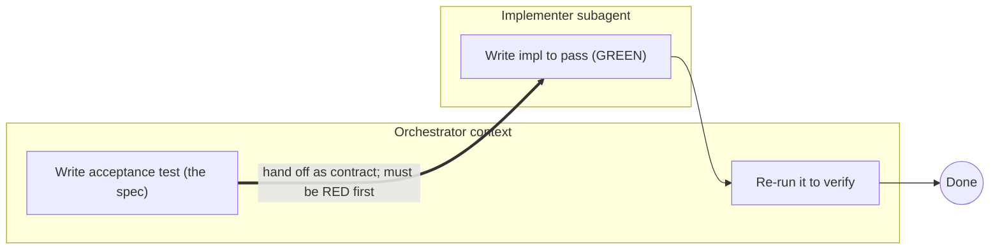
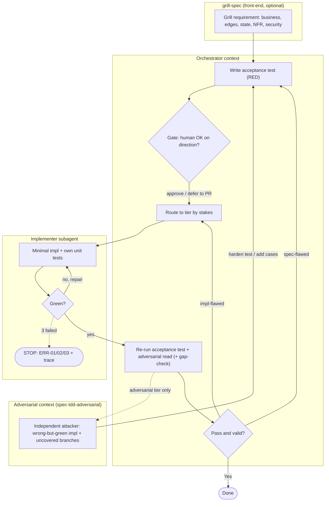

# spec-tdd — test-first development skills for Claude Code

**Version 1.0.0** · [Changelog](CHANGELOG.md) · [License](LICENSE)

A family of [Claude Code](https://claude.com/claude-code) skills for test-first feature development delegated to a subagent.

## The problem: the green lie

Let one agent write both the tests and the code and you get the **green lie** — tests that pass only because the same mind wrote both, so they mirror the implementation's assumptions, skip the edges it forgot, and assert tautologies. The suite goes green; the code is still wrong. **You let the same brain be both referee and player.**

Most TDD guidance fights this with *prompting* — exhorting the agent to stay objective. Same agent, same context, trying not to fool itself. Under pressure, it loses.

## The fix: an agent boundary

`spec-tdd` doesn't persuade; it changes the **structure**. One agent (the orchestrator) writes the acceptance test — the spec — *before any implementation exists*, then hands it to a *different* agent (the implementer) as the contract. Written before the impl, by a different context, the test cannot mirror it:

> **"Must be RED first" is the built-in green-lie detector.**

This isn't a new religion — it's established software engineering (black-box testing, contract / seam-driven design, independent verification) ported to agent orchestration. The agent boundary turns "don't fool yourself" from a discipline into a structural guarantee.

Each skill was authored and pressure-tested with the TDD-for-docs process (baseline a failure mode without the skill, then write the skill to counter it).

## Architecture & Agent Boundaries

The anti-green-lie guarantee comes from **separating spec-authoring and implementation into different agent contexts**; `spec-tdd-adversarial` adds a third, independent context (an attacker) for critical paths. Two views — the core principle, then the complete flow.

### Core — why the agent boundary matters



The acceptance test is written in the orchestrator's context *before* the impl exists, then handed to a different context (the implementer) as the contract. Crossing that boundary is what stops the test from mirroring the impl — the whole point.

### Complete flow



- **Orchestrator → Implementer** is the delegation handoff (acceptance test = contract); the **3-strike circuit breaker** caps the implementer's repair loop and tags `ERR-01 env · ERR-02 logic · ERR-03 syntax`.
- **Verification is orchestrator-run** ("don't trust the subagent's self-report") and **routed by root cause** on failure: spec-flawed → fix the test; impl-flawed → re-delegate.
- **Context3 (attacker)** is `spec-tdd-adversarial` only. `grill-spec` adds the requirement grill *before* the acceptance test and routes to the matching tier (`spec-tdd` / `spec-tdd-coverage` / `spec-tdd-adversarial`).

## The family

Four skills, organized as **a verification ladder + a grilling front-end**:

| Skill | Role |
|---|---|
| [`spec-tdd`](skills/spec-tdd/SKILL.md) | The base. Orchestrator writes the acceptance test (RED), delegates to one subagent, verifies by running it. |
| [`spec-tdd-coverage`](skills/spec-tdd-coverage/SKILL.md) | `spec-tdd` + **coverage evidence**: the subagent declares a case-list *before* impl and reports per-class branch %; the orchestrator gap-checks. |
| [`spec-tdd-adversarial`](skills/spec-tdd-adversarial/SKILL.md) | `spec-tdd-coverage` + an **independent attacker** (a third agent context) that tries to write a wrong-but-green impl and hunts uncovered branches. Top tier — critical paths only. |
| [`grill-spec`](skills/grill-spec/SKILL.md) | A **front-end**: interrogate a fuzzy/high-stakes requirement ("grill"), write the acceptance test, gate it, *then route* to whichever verification tier fits. |

The ladder inherits upward: `spec-tdd` → `spec-tdd-coverage` → `spec-tdd-adversarial`. `grill-spec` is orthogonal — a Phase-1 front-end that composes with any tier, so `grill × {spec-tdd, coverage, adversarial}` are all reachable **without** duplicating skills into monolithic combos.

Every tier's handoff carries a **3-strike circuit breaker** (stop after 3 repair attempts; tag the failure `ERR-01` env/dep · `ERR-02` logic · `ERR-03` syntax, with a truncated trace) and **dual-track failure routing** (spec-flawed → fix the test; impl-flawed → re-delegate with the error tag).

## When to use which

```
Correctness-CRITICAL? (money movement / auth-permissions / data-loss)
  yes → spec-tdd-adversarial
  no  → Need branch-coverage EVIDENCE? (large/subtle branch surface, weak tests, compliance)
          yes → spec-tdd-coverage
          no  → Requirement FUZZY or high-stakes?
                  yes → grill-spec   (grills, then routes to the right tier)
                  no  → spec-tdd      (the cheap default)
```

Rule of thumb: unsure? Start with `grill-spec` — it grills the requirement and routes to the matching tier for you.

## How it relates to the `superpowers` plugin

Complementary, not redundant:

- `superpowers:test-driven-development` is single-agent atomic TDD (RED→GREEN→REFACTOR). `spec-tdd` *uses* that discipline but splits it across the agent boundary — adding the structural green-lie defense that single-agent TDD cannot provide.
- `superpowers:subagent-driven-development` verifies via a reviewer reading a *prose spec*; `spec-tdd` verifies by *running an executable spec* (the acceptance test). Different bets, and `spec-tdd` is far lighter (1 subagent vs implementer + 2 reviewers per task).

You do **not** need `superpowers` installed — `spec-tdd` is self-contained.

## Installation

Copy the skills into your personal skills directory:

```bash
# from this repo's root
cp -r skills/* ~/.claude/skills/
```

Then invoke in Claude Code with `/<skill-name> <feature>`, e.g.:

```
/grill-spec add coupon discounts to checkout (Java/Spring, Order at src/main/.../Order.java)
```

## A quick walkthrough

1. **Grill** — `grill-spec` interrogates every dimension in batches (business logic, boundaries, state transitions, NFRs, security/fraud) and forces an explicit decision on each.
2. **Write the acceptance test** — behavioral, black-box; run it to confirm RED.
3. **Gate** — the test + decisions surface for a quick human OK *before* delegating (the cheapest direction-check).
4. **Route** — `grill-spec` picks the tier by stakes (e.g. money → `spec-tdd-adversarial`).
5. **Delegate** — a subagent implements to green; the circuit breaker guards against runaway loops.
6. **Verify** — the orchestrator runs the acceptance test itself, reads it adversarially, reports.

For plain `spec-tdd`, skip the grill batch and route; the gate surfaces the test at verification time.

## Why it works

- **Agent-boundary = anti-green-lie.** A test written before the impl exists, by a different context, can't mirror it.
- **Coverage as evidence, not luck.** `spec-tdd-coverage` makes branch coverage a measured, reported artifact with a case-list to audit — not a hopeful side-effect of green tests.
- **Independence for critical paths.** `spec-tdd-adversarial` adds a third context (an attacker) that a diligent same-context agent cannot give itself.
- **Grill before you build.** `grill-spec` forces every requirement dimension explicit (incl. NFR + security) instead of collapsing to "sensible defaults" under pressure.

## License

MIT — see [LICENSE](LICENSE).
